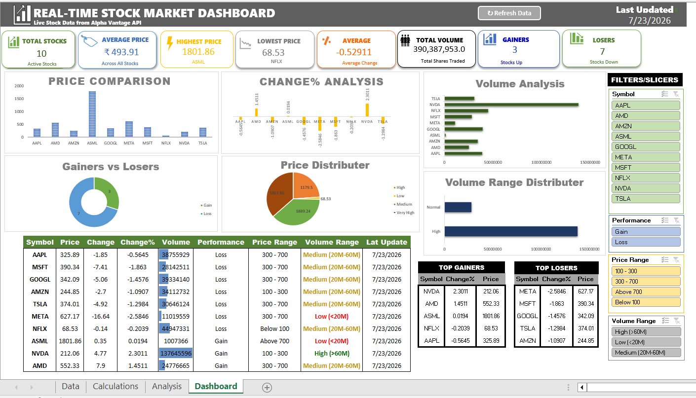

## 📈 Real-Time Stock Market Dashboard (Excel + Python + VBA + Alpha Vantage API)

An interactive, one-click-refresh stock market dashboard built using Python, VBA, Power Query, the Alpha Vantage API, and Microsoft Excel (Advanced Excel). The project automatically fetches live stock market data, processes it through Power Query, and visualizes key market trends through a fully automated, interactive dashboard.

---
## 📌 Project Overview

The Real-Time Stock Market Dashboard is an end-to-end data analytics project that combines Python automation, Power Query transformation, and VBA-driven refresh logic with Advanced Excel to create a live financial reporting dashboard.

A Python script fetches the latest stock market data from the Alpha Vantage API and writes it to a structured data source. Power Query then imports and cleans this data directly inside Excel. A VBA macro, triggered by a single button, orchestrates the entire refresh sequence — re-running the data pull, refreshing the Power Query connection, and updating every Pivot Table, Pivot Chart, and KPI card — so the whole dashboard updates with one click, no manual steps required.

This project demonstrates practical skills in API integration, data extraction, Power Query transformation, VBA automation, dashboard development, and business reporting.

---

## 🎯 Objectives

- Fetch real-time stock data automatically via API
- Transform and clean data using Power Query
- Automate the full refresh cycle with a VBA macro
- Analyze stock performance and compare stock prices
- Identify top gainers and losers
- Analyze trading volume
- Categorize stocks by price and volume
- Build a fully interactive, one-click-refresh Excel dashboard

  ---

## 🛠 Tech Stack

- Python
- Alpha Vantage API
- Microsoft Excel
- Advanced Excel
- Power Query
- VBA (Visual Basic for Applications)
- Pivot Tables
- Pivot Charts
- Slicers
- Conditional Formatting

  ---

## 📂 Project Structure

```
Real-Time-Stock-Market-Dashboard/
│
├── data/
│   └── stock_data.xlsx
│
├── images/
│   └── dashboard.png
│
├── python/
│   └── fetch_stock_data.py
│
├── vba/
│   └── refresh_macro.bas
│
├── videos/
│   ├── demo.mp4
│   └── link
│
├── LICENSE
├── README.md
├── Real-Time Stock Market Dashboard.xlsx
└── Report.docx
```

---

## 🔄 Project Workflow

```
Alpha Vantage API
        │
        ▼
 Python Script
        │
        ▼
 Excel Data Sheet
        │
        ▼
 Power Query (Transform & Clean)
        │
        ▼
 Calculation Sheet
        │
        ▼
 Pivot Tables
        │
        ▼
 Pivot Charts
        │
        ▼
 VBA Refresh Macro (One-Click Update)
        │
        ▼
 Interactive Dashboard
```

---

## 📊 Dashboard Features

### KPI Cards
- Total Stocks
- Average Price
- Highest Price
- Lowest Price
- Average Change %
- Total Trading Volume
- Total Gainers
- Total Losers
- Last Updated Date

### Interactive Charts
- Price Comparison
- Change % Analysis
- Volume Analysis
- Gainers vs Losers
- Price Range Distribution
- Volume Range Distribution

### Market Summary Table
The dashboard displays:
- Symbol
- Current Price
- Price Change
- Change %
- Trading Volume
- Performance (Gain/Loss)
- Price Range
- Volume Category
- Last Updated

### Interactive Filters
The dashboard includes slicers for:
- Stock Symbol
- Performance (Gain/Loss)
- Price Range
- Volume Range

Users can filter all charts and tables instantly.

---

## 📈 Data Processing

After fetching data from the API, Power Query and Excel formulas automatically perform transformations to create additional business insights.

Calculated fields include:
- Price Movement
- Price Band
- Volume Category
- Volume Range

These fields are used throughout the dashboard for reporting and filtering.

---

## 📊 Dashboard Insights

The dashboard helps users quickly identify:
- Highest priced stock
- Lowest priced stock
- Top gainers
- Top losers
- High-volume stocks
- Overall market trend
- Distribution of stocks across different price bands

---

## 🔁 One-Click Refresh Process

1. Click the **Refresh Dashboard** button (VBA macro) on the dashboard sheet.
2. The macro triggers the Python data fetch, pulling the latest data from the Alpha Vantage API.
3. Power Query automatically re-imports and cleans the updated data.
4. All Pivot Tables, Pivot Charts, KPI cards, and slicers refresh in sequence.
5. The "Last Updated" timestamp updates automatically to confirm the refresh completed.

No manual steps beyond the single click are required.

---

## 🎥 Project Demo


🎥 [Watch Demo Video](https://drive.google.com/file/d/1LvJmbdnQ0ea-ci2NiQn80ft4i41-en4C/view?usp=sharing)

---

## 💡 Skills Demonstrated

- Python
- API Integration
- Data Extraction
- Power Query
- VBA Automation
- Excel Automation
- Data Processing
- Advanced Excel
- Pivot Tables
- Pivot Charts
- Interactive Dashboard Design
- KPI Cards
- Conditional Formatting
- IF Functions, COUNTIF, SUM, AVERAGE, MAX, MIN
- Data Validation
- Slicers

---

## 📈 Business Use Cases

- Stock Market Analysis
- Financial Reporting
- Investment Monitoring
- Portfolio Tracking
- Business Intelligence Reporting

---

## 🚀 Future Enhancements

- Historical Stock Analysis
- Moving Average Indicators
- Power BI Dashboard Version
- Scheduled Auto-Refresh (Task Scheduler Integration)

---

## 👩‍💻 Author

**Anushka Yadav**
B.Tech (Computer Science & Engineering – AI & ML)
Aspiring Data Analyst | Business Intelligence Analyst
